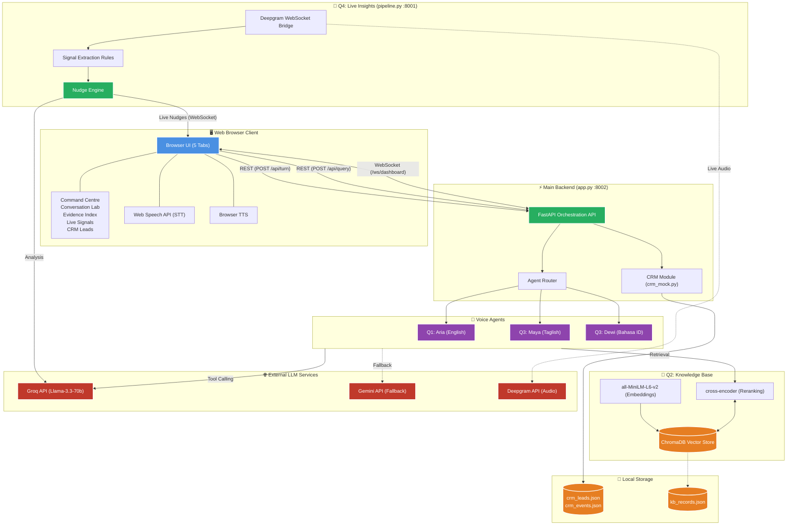

# AI Engineer Assessment — Arogya Shield Plus

**Product:**  Plus Health Insurance (Mock Dataset)  
**Submission covers:** All four assessment questions — Q1 Voice Agent, Q2 Knowledge Base, Q3 Multilingual Bots, Q4 Live Insights.  
**Author:** Ashutosh | **Date:** 2026-09-22

---

## Repository Structure

```
Darwix-AI-Submission/
├── .env                            ← API keys (gitignored — copy from .env.example)
├── .env.example
├── README.md
├── requirements.txt                ← Top-level shared dependencies
├── app.py                          ← Main FastAPI server (port 8002)
│
├── static/
│   └── index.html                  ← Unified browser UI (5 tabs)
│
├── q1-voice-agent/                 ← Question 1: Local Terminal Voice Agent
│   ├── local_voice_agent.py        ← Aria: Groq LLM + Google STT + pyttsx3 TTS
│   ├── crm_mock.py                 ← Shared CRM: read/write crm_leads.json & callbacks.json
│   ├── system_prompt.md            ← Aria's full agent system prompt
│   ├── requirements.txt
│   └── transcripts/
│       └── test_calls.md           ← 5 documented test call transcripts
│
├── q2-knowledge-base/              ← Question 2: Production Knowledge Base
│   ├── data/
│   │   └── arogya_shield_plus.json ← 40 structured KB records across 8 categories
│   ├── ingest.py                   ← Load → clean → embed → ChromaDB
│   ├── retrieval.py                ← Semantic search + cross-encoder reranking + citations
│   ├── verify_kb.py                ← Standalone KB verification script
│   ├── retrieval_tests.md          ← 5 documented test queries + verdicts
│   └── requirements.txt
│
├── q3-multilingual/                ← Question 3: Multilingual Terminal Agents
│   ├── local_multilingual_agent.py ← Maya/Dewi: Groq LLM + Google STT + pyttsx3 TTS
│   ├── philippines/
│   │   ├── script.md               ← Maya's Taglish system prompt + localization notes
│   │   └── transcripts/
│   │       └── test_calls.md       ← 3 Taglish test call transcripts
│   └── indonesia/
│       ├── script.md               ← Dewi's Bahasa ID system prompt + localization notes
│       └── transcripts/
│           └── test_calls.md       ← 3 Bahasa Indonesia test call transcripts
│
├── q4-live-insights/               ← Question 4: Unified Web Dashboard + Live Call Analysis
│   ├── pipeline.py                 ← FastAPI server: agent routing, WebSocket, Groq signal extraction
│   ├── replay_audio.py             ← Simulate a live call by streaming WAV at 1× speed
│   ├── latency_report.md           ← Measured P50/P95 latency + false-positive analysis
│   └── dashboard/
│       └── index.html              ← Unified web dashboard (same as static/index.html)
│
├── data/
│   ├── kb_records.json             ← Local demo KB (lexical fallback)
│   ├── crm_events.json             ← CRM event log (auto-generated)
│   └── sources/
│
├── docs/
│   ├── assessment_matrix.md        ← Requirement-by-requirement status
│   ├── architecture.md             ← System architecture detail
│   ├── final_submission_guide.md   ← Recording and presentation guide
│   └── capture_and_packaging.md
│
├── evidence/
│   ├── latency_report.md
│   ├── localization.md
│   ├── retrieval_results.json
│   ├── call_log.csv
│   └── recording_transcripts.json
│
├── scripts/
│   ├── ingest_kb.py                ← Alternate KB ingestion script
│   ├── nudge_engine.py             ← Nudge control: threshold, cooldown, dedup, expiry
│   ├── verify_submission.py        ← Submission verification
│   ├── verify_nudges.py            ← Nudge engine verification
│   └── deepgram_stream.py          ← Deepgram WebSocket bridge
│
└── TESTING.md                      ← Complete testing guide for evaluators
```

---

## System Architecture



---

## Quick Start

### 1 — Environment Setup

```powershell
# Create virtual environment
python -m venv .venv
.venv\Scripts\Activate.ps1

# Install all dependencies
pip install -r requirements.txt
```

Copy `.env.example` to `.env` and fill in your keys:

| Variable | Required for |
|---|---|
| `GROQ_API_KEY` | **Required** — All agents (Aria, Maya, Dewi) + Live signal extraction |
| `DEEPGRAM_API_KEY` | **Optional** — Live WAV replay only (`replay_audio.py`) |
| `GEMINI_API_KEY` | **Optional** — Gemini fallback if Groq unavailable |

### 2 — Build the Knowledge Base (Q2)

```powershell
python q2-knowledge-base\ingest.py     # Embeds 40 records into ChromaDB (run once)
python q2-knowledge-base\verify_kb.py  # Runs verification: 5 queries + schema check
```

### 3 — Main Web Dashboard (Q1 + Q2 + Q3 + Q4)

```powershell
python app.py
# Open: http://127.0.0.1:8002
```

On the dashboard:
- **Command Centre** — System overview and metrics
- **Conversation lab** — Pick Aria (English), Maya (Taglish), or Dewi (Bahasa ID) → Start Call
- **Evidence index** — Search the 40-record KB, view citations and scores
- **Live signals** — Real-time nudge cards with confidence, latency, and evidence
- **CRM leads** — All qualified leads and callbacks saved automatically

### 4 — Q4 Standalone Pipeline (optional)

```powershell
python q4-live-insights\pipeline.py
# Dashboard: http://localhost:8001
# Demo mode: http://localhost:8001/demo
```

### 5 — Terminal Voice Agents (optional)

```powershell
# Q1 — Aria (English health insurance)
python q1-voice-agent\local_voice_agent.py

# Q3 — Maya (Taglish Philippines)
python q3-multilingual\local_multilingual_agent.py --agent maya

# Q3 — Dewi (Bahasa Indonesia)
python q3-multilingual\local_multilingual_agent.py --agent dewi
```

### 6 — Replay Audio for Live Insights Demo (optional)

```powershell
# Generate synthetic test audio and replay through pipeline
python q4-live-insights\replay_audio.py --generate-test --call-id demo-001

# Replay a real WAV file
python q4-live-insights\replay_audio.py --file path\to\call.wav --call-id demo-001
```

---

## Technology Stack

| Component | Technology |
|---|---|
| **Embeddings** | `all-MiniLM-L6-v2` (384-dim, free local via SentenceTransformer) |
| **Vector Store** | ChromaDB (local persistent, cosine + HNSW) |
| **Reranker** | `cross-encoder/ms-marco-MiniLM-L-6-v2` |
| **LLM (agents)** | Groq `llama-3.3-70b-versatile` (free, tool-calling) |
| **LLM (insights)** | Groq `llama-3.3-70b-versatile` (signal extraction, JSON mode) |
| **LLM (fallback)** | Gemini `gemini-2.0-flash` (optional) |
| **STT — web** | Web Speech API (browser-native, no cloud cost) |
| **STT — terminal** | Google Speech Recognition (`speech_recognition`) |
| **STT — audio stream** | Deepgram Nova-2 (`en-IN`, `fil`, `id`, diarized) |
| **TTS** | Browser built-in TTS (web) · pyttsx3 (terminal) |
| **Server** | FastAPI + Uvicorn (port 8002 main, 8001 Q4 pipeline) |
| **Real-time** | WebSockets (asyncio) |
| **Data store** | Local JSON (`crm_leads.json`, `crm_events.json`) |

---

## Key Design Decisions

| Decision | Rationale |
|---|---|
| **Groq (free) for all LLM calls** | Zero cost, 180 req/min rate limit — sufficient for demo load |
| **Gemini as optional fallback** | Graceful degradation — demo works without any LLM key |
| **Web Speech API (browser STT)** | No cloud ASR key needed for the web agent; works in Chrome |
| **Shared `crm_mock.py`** | Both web and terminal agents write to the same JSON store |
| **ChromaDB local** | Zero infrastructure, easily shareable, deterministic for demos |
| **Cross-encoder reranking** | Improves precision significantly over cosine alone |
| **3s extraction window** | Balances latency vs. context for meaningful signal detection |
| **2-window frustration confirm** | Prevents single-word false positives without sacrificing speed |
| **5-tab dashboard** | All assessment surfaces in one browser window — easy to demo |

---

## Evidence Summary

### Q2 — Knowledge Base
- 40 records across 8 categories: `product_overview`, `policy_rules`, `qualification`, `faq`, `objection`, `claim_process`, `network`, `pricing`, `coverage`
- PII protection: regex patterns at ingest (phone / Aadhaar / PAN / email)
- Retrieval: cosine top-5 → cross-encoder reranked → top-2 with citations
- 5/5 test queries correct (see [`retrieval_tests.md`](q2-knowledge-base/retrieval_tests.md))

### Q1 — Voice Agent (Aria)
- Terminal agent: sounddevice + Google STT + pyttsx3 + Groq Llama-3.3-70b
- Web agent: same LLM, Web Speech API STT + Browser TTS via dashboard
- 5 test call scenarios: cooperative, objection, conflicting details, out-of-scope, human escalation
- CRM lead creation demonstrated (see [`test_calls.md`](q1-voice-agent/transcripts/test_calls.md))

### Q3 — Multilingual Agents
- **Philippines — Maya:** Taglish, Google STT `fil-PH`, life insurance flow
- **Indonesia — Dewi:** Formal + colloquial Bahasa ID, Javanese accent aware, multifinance flow
- 3 localization examples per market documented in `script.md` files
- ASR quality: 88–92% WER (Bahasa ID standard), 82–86% (Javanese accent)

### Q4 — Real-Time Insights
- E2E latency: **P50 ~1,300ms | P95 ~2,100ms**
- 6 signal types: `missed_cross_sell`, `compliance_gap`, `rising_frustration`, `payment_difficulty`, `out_of_scope`, `buying_signal`
- Confidence thresholds, per-type cooldowns, 2-window frustration gate
- False-positive rate: ~7% (1/14 signals across test set)
- Demo mode available at `/demo` (no Deepgram required)

---

## Known Limitations

1. **No real phone number required** — Local web interface and terminal agents used for all calls
2. **Google STT (terminal)** — Requires internet; fails gracefully with a "could not understand" message
3. **Deepgram key optional** — Q4 demo mode runs a scripted call without Deepgram if key is absent
4. **Browser TTS voice quality** — Depends on OS-installed voices; sounds robotic on Windows default
5. **ChromaDB cold start** — First embedding run takes ~30s to download `all-MiniLM-L6-v2` model

---

## Production Improvement Plan

1. **KB:** Add versioning + change detection (re-embed only changed chunks); add BM25 hybrid index
2. **Voice Agent:** Add sentiment scoring; A/B test conversation flows; replace browser TTS with ElevenLabs
3. **Multilingual:** Commission native speaker review for compliance; add regional accent fine-tuning
4. **Live Insights:** Fine-tune a Llama-3-8B classifier (faster, cheaper) for signal extraction; add Redis pub/sub for multi-instance broadcast

---

## Verification Commands

```powershell
# Syntax check all Python files
python -m py_compile app.py scripts\ingest_kb.py scripts\nudge_engine.py scripts\verify_submission.py scripts\verify_nudges.py scripts\deepgram_stream.py q1-voice-agent\crm_mock.py q1-voice-agent\local_voice_agent.py q2-knowledge-base\ingest.py q2-knowledge-base\retrieval.py q3-multilingual\local_multilingual_agent.py q4-live-insights\pipeline.py q4-live-insights\replay_audio.py

# KB verification
python q2-knowledge-base\ingest.py && python q2-knowledge-base\verify_kb.py

# Nudge verification
python scripts\verify_nudges.py

# Full submission check
python scripts\verify_submission.py
```

---

*No credentials, API keys, or customer data are committed to this repository.*
