# Aegis Conversation Studio Architecture

```mermaid
flowchart LR
  Browser[Browser voice and text UI] --> API[FastAPI orchestration API]
  API --> KB[Knowledge base retrieval]
  KB --> Records[(Versioned records)]
  API --> Agent[Optional Gemini reasoning]
  API --> CRM[(Local CRM event log)]
  Replay[Replay transcript windows] --> Signals[Nudge signal rules]
  Signals --> API
  API --> Browser
```

## Connected path

1. A caller message enters the browser conversation lab.
2. The API retrieves candidate records and attaches record ID, source, version, and score.
3. Gemini is used only when `GEMINI_API_KEY` is available; otherwise the grounded demo fallback returns the matched evidence.
4. A lead action writes an event to the local CRM log.
5. The live signal desk displays nudge events with evidence, confidence, priority, cooldown intent, and latency.

The current records are assessment demo content and are explicitly labelled as such. Replace them with approved public or organizational documents before production use.
